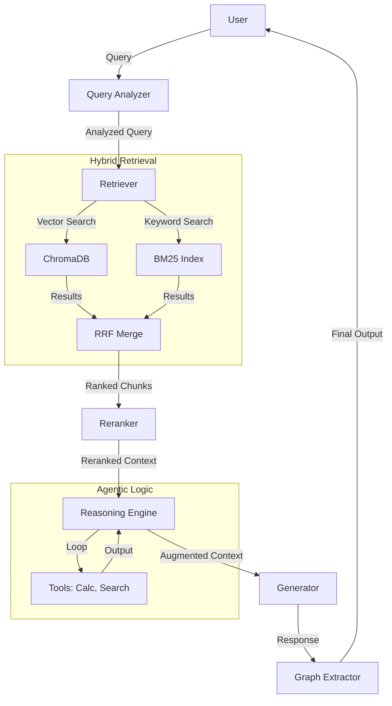

# PDF Knowledge Explorer - Observability Platform Comparison

A RAG (Retrieval-Augmented Generation) system designed for competitive analysis of LLM observability platforms.

## Overview

This project implements a PDF Knowledge Explorer that allows you to:
1. Upload and index PDF documents
2. Ask natural language questions about the content
3. Get AI-generated answers with citations
4. **Compare how 9+ different observability platforms capture and display traces**

## 🚀 New Features (February 2026)

### Performance Benchmarking
- **Measure actual SDK overhead** for each observability provider
- Compare latency impact with statistical analysis (avg, median, P95, P99)
- Identify the fastest providers for your use case
- Export results for decision-making

### Automatic Capability Detection
- **Auto-test each provider** for supported features
- Automatically fill comparison matrix based on actual behavior
- Save hours of manual testing
- Get confidence scores for each detection

### Sample Data Loader
- **Start testing immediately** with pre-generated sample PDF
- Includes comprehensive content about LLM observability
- 8 sample queries covering different scenarios
- No need to find and upload your own documents

### Enhanced Comparison Matrix
- New criteria categories: Debugging & RCA, Security, Optimization, Agentic Logic
- Auto-fill from capability detection
- Export to JSON/Markdown
- Visual rankings and charts

See [IMPROVEMENTS.md](docs/IMPROVEMENTS.md) for detailed documentation.


## Observability Platforms Tested

| # | Platform | SDK | Integration Method |
|---|----------|-----|-------------------|
| 1 | LangSmith | `langsmith` | RunTree API / @traceable decorator |
| 2 | Langfuse | `langfuse` | @observe decorator + trace() API |
| 3 | Arize Phoenix | `arize-phoenix` | OpenTelemetry instrumentor |
| 4 | Opik | `opik` | @track decorator |
| 5 | Braintrust | `braintrust` | @traced decorator + init_logger() |
| 6 | Laminar | `lmnr` | @observe decorator |
| 7 | AgentOps | `agentops` | agentops.init() + auto-instrumentation |
| 8 | Evidently AI | `evidently` | ML monitoring (no real-time tracing) |
| 9 | Pydantic Logfire | `logfire` | logfire.instrument_openai() + @span |

## Architecture


### Pipeline Steps

| Step | What it does | Span Type | What we test |
|------|-------------|-----------|--------------|
| Query Analyzer | Determines intent, extracts entities | LLM | Prompt/completion logging, classification |
| Retriever | Vector search in ChromaDB | RETRIEVER | Retrieved docs, scores, metadata |
| Reranker | Sorts chunks by relevance | LLM | Scoring, batch processing |
| Generator | Generates answer with citations | LLM | Streaming, token count, cost |
| Graph Extractor | Extracts concept relationships | LLM | Structured output, JSON parsing |

## Installation

```bash
# Clone the repository
git clone <repo-url>
cd pdf-knowledge-rag

# Create virtual environment
python -m venv .venv
source .venv/bin/activate  # On Windows: .venv\Scripts\activate

# Install dependencies
pip install -e .
```

## Configuration

1. Copy the example environment file:
```bash
cp .env.example .env
```

2. Add your API keys:
```bash
# Required
OPENAI_API_KEY=sk-...

# Select which providers to use
OBSERVABILITY_PROVIDERS=langsmith,langfuse

# Add keys for selected providers
LANGCHAIN_API_KEY=ls-...
LANGFUSE_PUBLIC_KEY=pk-...
LANGFUSE_SECRET_KEY=sk-...
# ... etc
```

## Usage

### Streamlit UI

```bash
streamlit run app.py
```

### CLI Usage

```python
from src.pipeline.traced_orchestrator import TracedRAGOrchestrator
from pathlib import Path

# Initialize
orchestrator = TracedRAGOrchestrator()

# Ingest PDFs
doc, chunks = orchestrator.ingest_pdf(Path("paper.pdf"))
print(f"Ingested {chunks} chunks")

# Query
result = orchestrator.query("What is the attention mechanism?")
print(result.response.answer)

# View trace URLs
for provider, url in orchestrator.obs_manager.get_trace_urls(trace).items():
    print(f"{provider}: {url}")
```

### Run Test Scenarios

```python
from scenarios import ScenarioRunner

runner = ScenarioRunner()
results = runner.run_all()
runner.export_results("results.json")
runner.print_summary()
```

## Test Scenarios

1. **Simple RAG** - Basic query to test fundamental tracing
2. **Multi-hop** - Cross-document retrieval with parallel spans
3. **Long Context** - Large payload handling and cost tracking
4. **Streaming** - Real-time trace updates and TTFT
5. **Error Handling** - Error capture and trace status
6. **Evaluation** - Batch evaluation with ground truth

## Comparison Matrix

The comparison evaluates each platform across 7 categories:

### A. Setup & Integration
- Time to first trace
- Lines of code for integration
- Auto-instrumentation support
- Documentation quality

### B. Tracing Features
- Nested/parallel spans
- Metadata support
- Input/output capture
- Streaming support
- Error handling

### C. LLM-Specific
- Token counting
- Cost calculation
- Prompt/completion display
- Multi-provider support

### D. Retrieval-Specific
- Document display
- Relevance scores
- Chunk previews
- Source metadata

### E. Evaluations
- Built-in evals
- Custom eval functions
- Human feedback UI
- Dataset management
- A/B comparison

### F. Production & UI
- Dashboards
- Search/filtering
- Trace comparison
- Alerting
- UI quality

### G. Business
- Self-hosted option
- Pricing
- Enterprise features

## Key Questions for Curestry

1. **Debugging UX** - How quickly can you find problems in traces?
2. **Retrieval visibility** - How are retrieved chunks displayed?
3. **Cost tracking** - Automatic vs manual? How accurate?
4. **Eval workflow** - How easy to run evaluations?
5. **Performance overhead** - SDK latency impact?
6. **Cold start** - Time from signup to useful trace?

## Market Gap Hypotheses

- [ ] No good diff between traces
- [ ] Poor retrieval quality visualization
- [ ] Hard to connect production issues with prompts
- [ ] No easy "replay" for problematic traces
- [ ] Weak CI/CD integration for regression testing

## Project Structure

```
pdf-knowledge-rag/
 app.py                    # Streamlit UI
 pyproject.toml            # Project configuration
 .env.example              # Environment template
 src/
    config.py             # Configuration management
    models.py             # Data models
    pipeline/             # RAG pipeline components
       ingestion.py      # PDF parsing & chunking
       query_analyzer.py # Intent detection
       retriever.py      # Vector search
       reranker.py       # LLM reranking
       generator.py      # Response generation
       graph_extractor.py# Concept extraction
       orchestrator.py   # Pipeline coordination
       traced_orchestrator.py  # With observability
    observability/        # Provider integrations
       base.py           # Abstract interfaces
       manager.py        # Multi-provider coordination
       providers/        # Individual implementations
    evaluations/          # Comparison tools
       comparison_matrix.py
 scenarios/               # Test scenario definitions
 data/                    # PDF storage & ChromaDB
 results/                 # Exported results
 screenshots/             # UI screenshots for comparison
```

## 🤝 Contributing

Contributions are welcome! See [CONTRIBUTING.md](CONTRIBUTING.md) for details.

## 📜 License

This project is licensed under the MIT License - see the [LICENSE](LICENSE) file for details.

## 🛡️ Security

See [SECURITY.md](SECURITY.md) for reporting vulnerabilities.

## 💬 Community

- **Code of Conduct**: We follow the [Contributor Covenant](CODE_OF_CONDUCT.md).
- **Issues**: Use the [issue tracker](https://github.com/letya999/compare_observability/issues) for bugs and features.
- **Discussions**: (Optional) Join our community discussions.

---
*Developed for research and comparison of AI observability platforms.*
